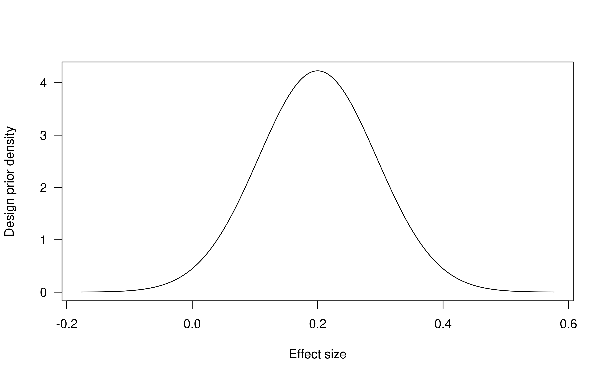

# BayesRepDesign

**BayesRepDesign** is an R package for Bayesian sample size calculation for
replication studies. See the [arXiv
preprint](https://doi.org/10.48550/arXiv.XXXX.XXXXX) for information on the
statistical framework underlying the package.

## Installation

```r
## dependency which is not on CRAN
remotes::install_gitlab(repo = "samuel.pawel/BayesRep", 
                        subdir = "pkg", host = "gitlab.uzh.ch")

remotes::install_github(repo = "SamCH93/BayesRepDesign")
```

## Usage

``` r
library("BayesRepDesign")

## design prior (flat initial prior for effect size + heterogeneity)
dp <- designPrior(to = 0.2, so = 0.05, tau = 0.08)
plot(dp)

```


``` r
## compute replication standard error for achieving significance at 2.5%
ssdSig(level = 0.025, dprior = dp, power = 0.8)

#>        Bayesian sample size calculation for replication studies
#>        ========================================================
#> 
#> success criterion and computation
#> ------------------------------------------------------------------------
#>   replication p-value <= 0.025 (exact computation) 
#>
#> original data and initial prior for effect size
#> ------------------------------------------------------------------------
#>   to = 0.2 : original effect estimate
#>   so = 0.05 : standard error of original effect estimate
#>   tau = 0.08 : assumed heterogeneity standard deviation
#>   N(mean = 0, sd = Inf) : initial normal prior
#>
#> design prior for effect size
#> ------------------------------------------------------------------------
#>   N(mean = 0.2, sd = 0.094) : normal design prior
#> 
#> probability of replication success
#> ------------------------------------------------------------------------
#>   PoRS = 0.8 : specified
#>  PoRS = 0.8 : recomputed with sr
#> 
#> required sample size
#> ------------------------------------------------------------------------
#>   sr = 0.045 : required standard error of replication effect estimate
#>   c = so^2/sr^2 ~= nr/no = 1.2 : required relative variance / sample size
 
## compute numerically via success region and method agnostic function
sregFun <- function(sr) {
    ## success region is [1.96*sr, Inf)
    successRegion(intervals = cbind(qnorm(p = 0.975)*sr, Inf))
}
ssd(sregionfun = sregFun, dprior = dp, power = 0.8)

#>        Bayesian sample size calculation for replication studies
#>        ========================================================
#> 
#> success criterion and computation
#> ------------------------------------------------------------------------
#>   method agnostic success region (numerical computation) 
#> 
#> original data and initial prior for effect size
#> ------------------------------------------------------------------------
#>   to = 0.2 : original effect estimate
#>   so = 0.05 : standard error of original effect estimate
#>   tau = 0.08 : assumed heterogeneity standard deviation
#>   N(mean = 0, sd = Inf) : initial normal prior
#> 
#> design prior for effect size
#> ------------------------------------------------------------------------
#>   N(mean = 0.2, sd = 0.094) : normal design prior
#> 
#> probability of replication success
#> ------------------------------------------------------------------------
#>   PoRS = 0.8 : specified
#>   PoRS = 0.8 : recomputed with sr
#> 
#> required sample size
#> ------------------------------------------------------------------------
#>   sr = 0.045 : required standard error of replication effect estimate
#>   c = so^2/sr^2 ~= nr/no = 1.2 : required relative variance / sample size
```

## References

* Pawel, S., Consonni, G., and Held, L. (2022). Bayesian approaches for designing
  replication studies.
  [doi:10.48550/arXiv.XXXX.XXXXX](https://doi.org/10.48550/arXiv.XXXX.XXXXX)
